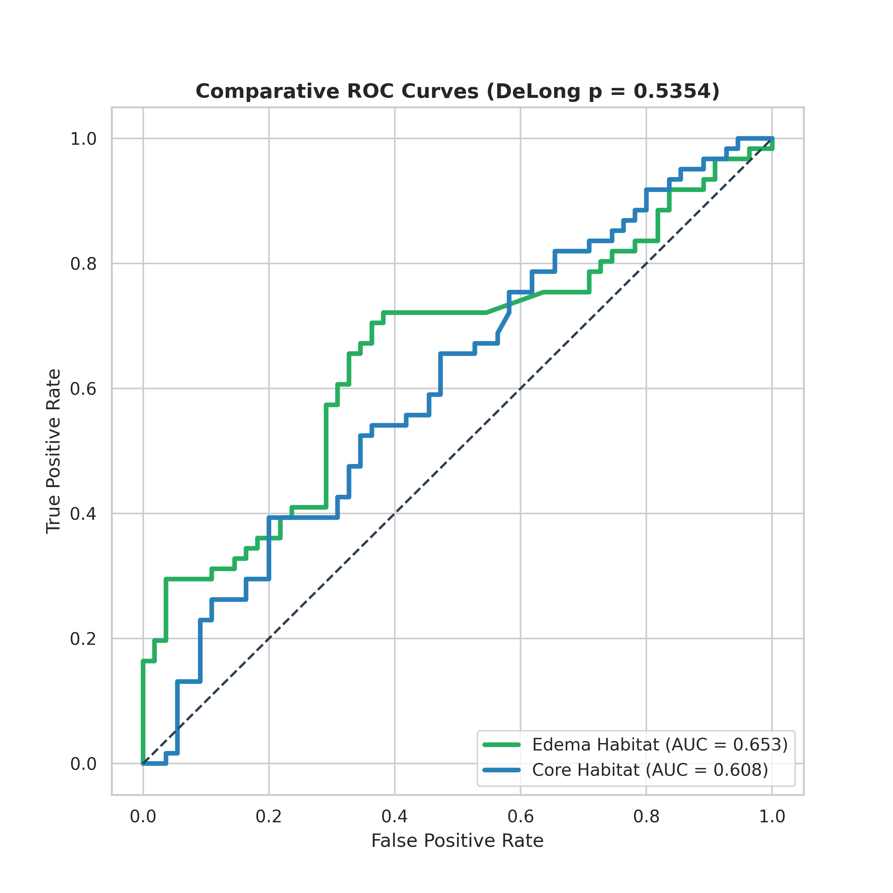
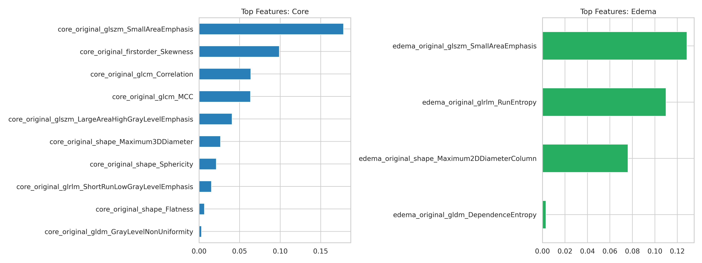

# Non-Invasive MGMT Prediction via Peritumoral Radiomics


---
*Developed as a digital initiative to integrate Artificial Intelligence and predictive molecular modeling into clinical neuroradiology.*

[](https://www.python.org/downloads/)
[](https://opensource.org/licenses/MIT)
[](https://www.med.upenn.edu/cbica/brats2021/)

This repository contains the complete pipeline for the non-invasive prediction of **MGMT** promoter methylation in Glioblastomas (GBM), utilizing an optimized machine learning approach focused on habitat radiomics.

---

## Author

**Rafael Boava Souza, MD** *Diagnostic Radiology Resident*

* **Current Affiliation:** Federal University of São Paulo (**UNIFESP**), Brazil.
---

## Overview
MGMT methylation is a critical biomarker for predicting response to Temozolomide. This project investigates whether the molecular signature of MGMT is manifested in the microstructural heterogeneity of the **peritumoral edema (FLAIR)** compared to the **tumor core (T1Gd)**.

By utilizing a robust cohort of **577 patients** (BraTS 2021), we demonstrate that radiomic features provide significant predictive value across different tumor compartments, supporting the role of the tumor microenvironment in molecular characterization.

## Methodology & Rigor
The pipeline implements:
* **Feature Selection:** LASSO (L1 Regularization) to identify the 10 most robust predictors per habitat.
* **Validation:** 5-Fold Stratified Cross-Validation and Grid Search for SVM hyperparameter tuning.
* **Statistical Comparison:** **DeLong Test** used to assess the significance of the difference between habitat performances (Core vs. Edema).
* **Benchmarking:** Comprehensive comparison across **SVM (RBF)**, **Random Forest**, and **XGBoost**.

## Performance Results
The **Support Vector Machine (SVM)** showed superior performance, particularly in the peritumoral habitat, though both habitats proved to be competent predictors.

### **Algorithm Benchmark**
| Model | Habitat | AUC (Independent Test Set) |
| :--- | :--- | :--- |
| **SVM (RBF)** | **Peritumoral Edema** | **0.653** |
| **SVM (RBF)** | Tumor Core | 0.616 |
| Random Forest | Edema | 0.606 |
| XGBoost | Edema | 0.588 |

### **Key Scientific Findings**
1. **Habitat Consistency:** Although the Peritumoral Edema achieved a higher AUC (0.653), the **DeLong Test ($p = 0.5354$)** indicates an "equal standing" with the Tumor Core. This suggests that MGMT molecular signatures are pervasive throughout the entire tumor microenvironment.
2. **Predictive Stability:** The model maintains high sensitivity for methylated cases, validated through cross-validation.

---

## Visual Results

### Comparative ROC Curves
Performance comparison between habitats with DeLong statistical validation.


### LASSO Feature Importance
Top 10 radiomic predictors identified by LASSO for both Tumor Core and Peritumoral Edema.


---

## Repository Structure
* `MGMT_Prediction_Optimized_Pipeline.ipynb`: Main notebook with LASSO selection, training, and benchmarking.
* `/results`: 
    * `comparative_roc_curve.png`: Dual ROC curves (Core vs. Edema) including DeLong p-value.
    * `auc_comparison_bar.png`: Comparison of SVM, RF, and XGBoost.
    * `model_stability_boxplot.png`: Cross-validation stability metrics.
    * `lasso_feature_importance.png`: Top 10 predictive features.
    * `confusion_matrix_final.png`: Detailed performance of the best SVM model.

## 🚀 How to Run
1. Clone this repository.
2. Install the dependencies:
   ```bash
   pip install -r requirements.txt
