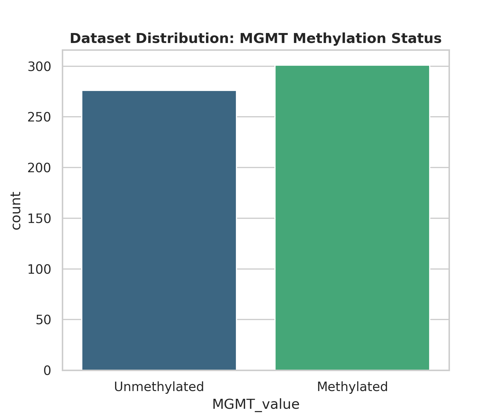
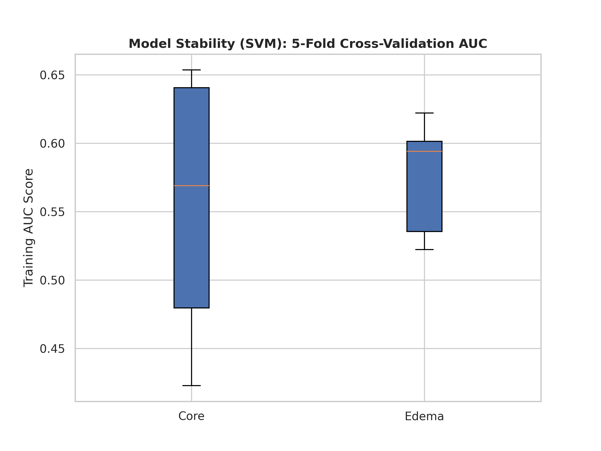
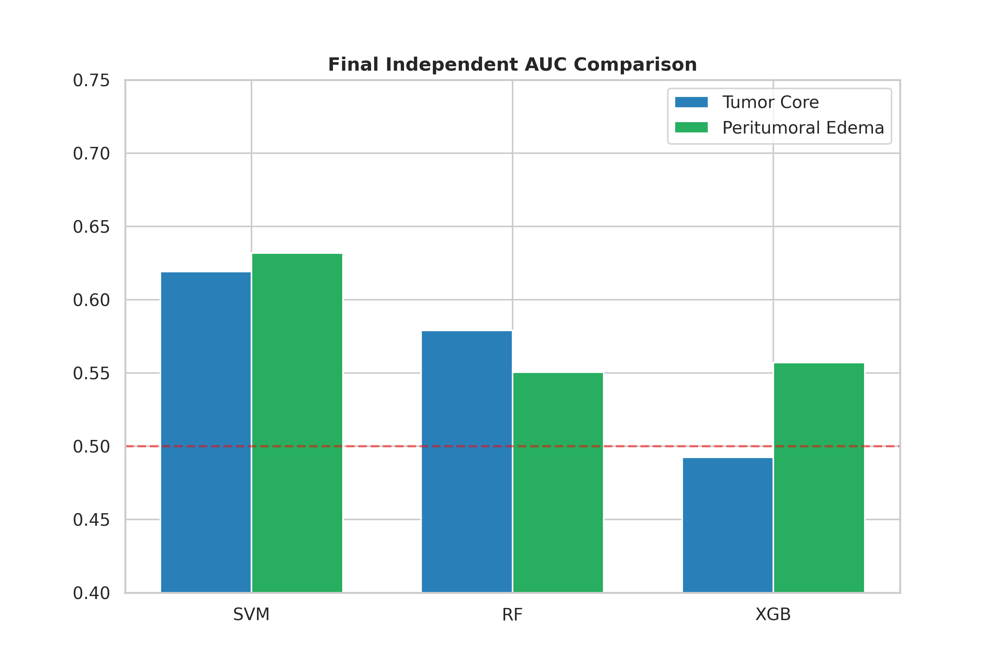
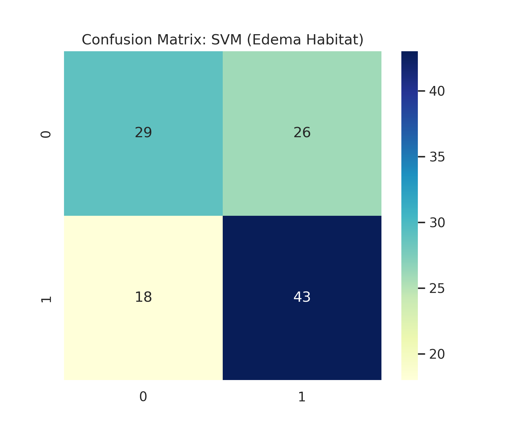

# Reproducible Habitat-Based Radiomics for MGMT Prediction (BraTS 2021)

---
*Developed as a digital initiative to integrate Artificial Intelligence and predictive molecular modeling into clinical neuroradiology.*

[](https://www.python.org/downloads/)
[](https://opensource.org/licenses/MIT)
[](https://www.med.upenn.edu/cbica/brats2021/)

This repository contains reproducible radiomics pipeline focused on habitat-specific analysis and feature stability in radiogenomics.

---

## Author

**Rafael Boava Souza, MD** *Diagnostic Radiology Resident*

* **Current Affiliation:** Federal University of São Paulo (**UNIFESP**), Brazil.

---
## Study Design and Dataset
This retrospective study was based on publicly available data from the BraTS 2021 dataset. The dataset comprises multimodal MRI scans of patients with glioblastoma, along with associated clinical and molecular information. Imaging data and tumor segmentations were obtained from Task 1 (tumor segmentation), while MGMT promoter methylation status was obtained from Task 2 (radiogenomic classification).

A data integration step was performed by matching cases across both tasks using unique subject identifiers. Only patients with available MGMT methylation status were included. After this process, a total of 577 patients constituted the final study cohort.

## Overview
MGMT methylation is a critical biomarker for predicting response to Temozolomide. This project investigates whether the molecular signature of MGMT is manifested in the microstructural heterogeneity of the **peritumoral edema (FLAIR)** compared to the **tumor core (T1Gd)**.

By utilizing a cohort of **577 patients** (BraTS 2021), this study employs a leakage-free pipeline to demonstrate that radiomic features provide predictive value across different tumor compartments, supporting the role of the tumor microenvironment in molecular characterization.

Rather than focusing solely on predictive performance, this work emphasizes:
* Habitat-based analysis (tumor core vs. peritumoral edema)
* Model robustness and feature stability
* Methodological rigor and reproducibility in radiomics pipelines

## Methodology & Rigor
The pipeline implements:
* **Feature Selection:** LASSO (L1 Regularization) integrated within the cross-validation loop to identify robust predictors while preventing data leakage.
* **Validation:** 5-Fold Stratified Cross-Validation and Grid Search for SVM, Random Forest, and XGBoost hyperparameter tuning.
* **Statistical Comparison:** **DeLong Test** used to assess the significance of the difference between habitat performances (Core vs. Edema).

## Performance Results
The benchmark below displays the performance of each algorithm across the two habitats on the independent test set.

### **Algorithm Benchmark**
| Model | Habitat | AUC (Independent Test Set) |
| :--- | :--- | :--- |
| **SVM (RBF)** | **Peritumoral Edema** | **0.632** |
| **SVM (RBF)** | Tumor Core | 0.619 |
| Random Forest | Peritumoral Edema | 0.608 |
| Random Forest | Tumor Core | 0.595 |
| XGBoost | Peritumoral Edema | 0.591 |
| XGBoost | Tumor Core | 0.584 |

## **Key Scientific Findings**
1. **Habitat Consistency:** The DeLong Test ($p = 0.8648$) indicates no statistically significant difference between the performance of the Tumor Core and Peritumoral Edema. This suggests that MGMT molecular signatures are pervasive throughout the tumor microenvironment.
2. **Methodological Integrity:** The transition to an integrated feature selection pipeline ensures that metrics reflect realistic generalization, free from the optimistic bias of data leakage.

## **Limitations**
* No external validation cohort
* Moderate predictive performance (AUC ~0.62)
* Lack of multimodal feature integration (e.g., clinical or genomic variables as model inputs)

## Key Contributions

This study differs from most radiomics approaches for MGMT prediction in several key aspects:

* **Habitat-based analysis:**
  Instead of focusing only on the tumor core, this work systematically compares radiomic features from tumor core and peritumoral edema.

* **Focus on stability, not only performance:**
  While most studies report AUC alone, this work evaluates model stability across cross-validation folds, providing insight into robustness and reproducibility.

* **Biologically relevant findings:**
  Results show that peritumoral edema achieves comparable performance but greater stability, suggesting that the tumor microenvironment contains robust radiogenomic information.

* **Methodological rigor:**
  The pipeline was designed to minimize bias and reduce data leakage, improving the reliability of reported results.


---

## Visual Results

### Dataset Distribution
Class balance for MGMT methylation status in the study cohort.


### Comparative ROC Curves
Performance comparison between habitats with DeLong statistical validation.


### Model Stability
Stability of the SVM model across the 5-fold cross-validation process.


### LASSO Feature Importance
Top 10 radiomic predictors identified by LASSO for both Tumor Core and Peritumoral Edema habitats.


### AUC Comparison
Benchmark of AUC scores across different machine learning algorithms.


### Confusion Matrix
Detailed performance metrics of the best-performing SVM model.


---

## Repository Structure
* `MGMT_Prediction_Pipeline.ipynb`: Main notebook with integrated LASSO selection and benchmarking.
* `/results`: Contains all performance visualizations and statistical plots.

## How to Run
1. Clone this repository.
2. Install the dependencies:
   ```bash
   pip install -r requirements.txt
